# Binary for uchain database

## Run

Prerequisite:

* [.Net core 2.2](https://dotnet.microsoft.com/download) which includes `.NET Core Runtime` and covers Linux/macOS and of course Windows.

Usage:

* See <https://github.com/uchaindb/Binary/releases> for download.
* Extract to any directory.
* Run
  ```
  $ dotnet NodeWeb.dll
  ```

## Play with docker (demo)

You can painless play with docker online:

* Step 1: Click [Here](https://labs.play-with-docker.com/?stack=https://raw.githubusercontent.com/uchaindb/Binary/master/stack.yml) to start.

* Step 2: Login with your Docker credentials. If you don’t have a Docker account go to <https://hub.docker.com> and create one.

  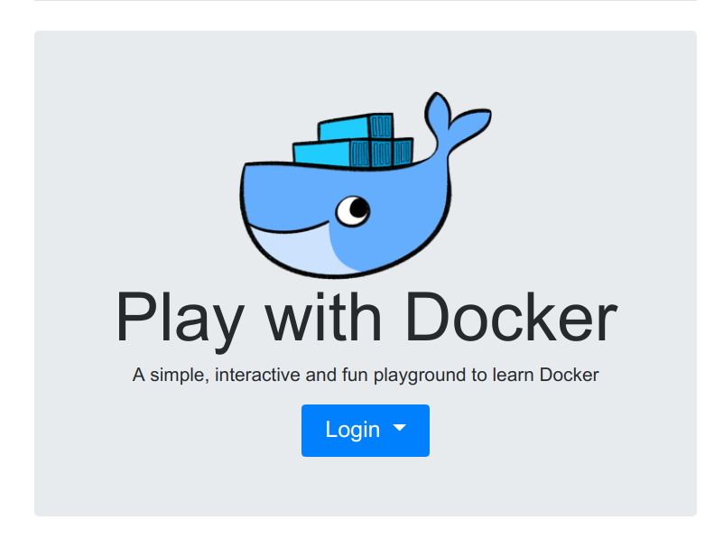
  

* Step 3: The required images will be downloaded in the remote virtual environment. Nothing will be downloaded on your computer, everything is executed in a remote server. After initialized, click close to continue.

  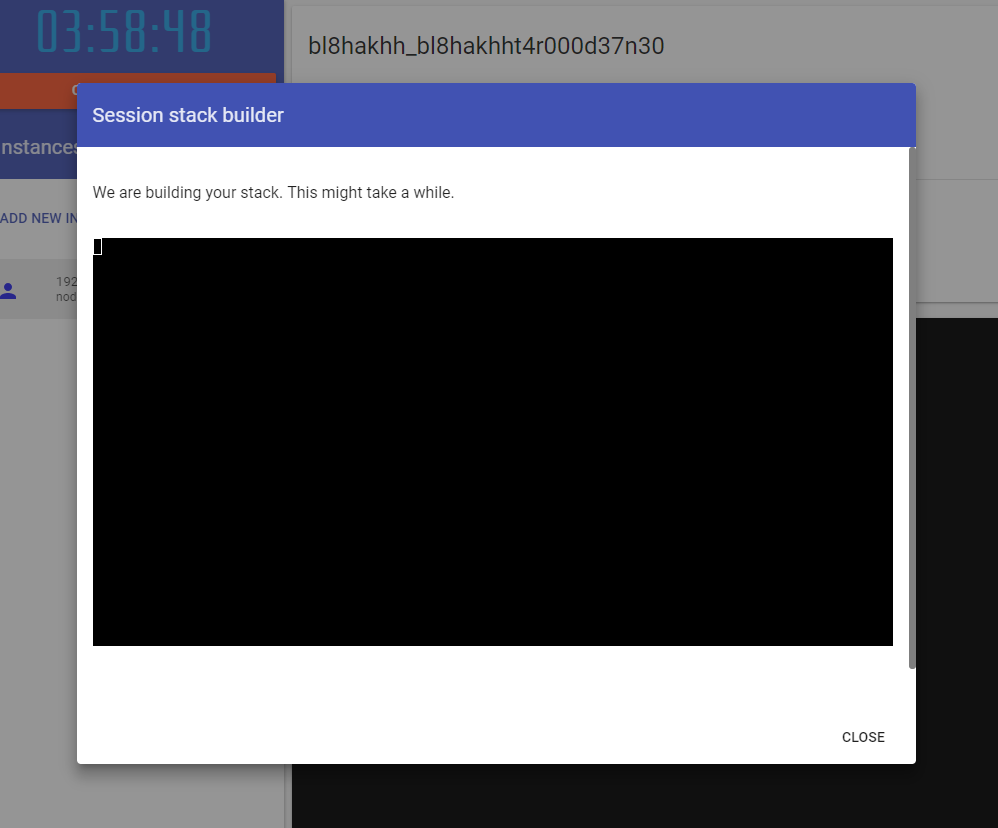

* Step 4: The uchaindb will begin to initialize. To monitor the initialization process, type `docker logs -f pwd`**&lt;and press tab key to autocomplete&gt;**.

  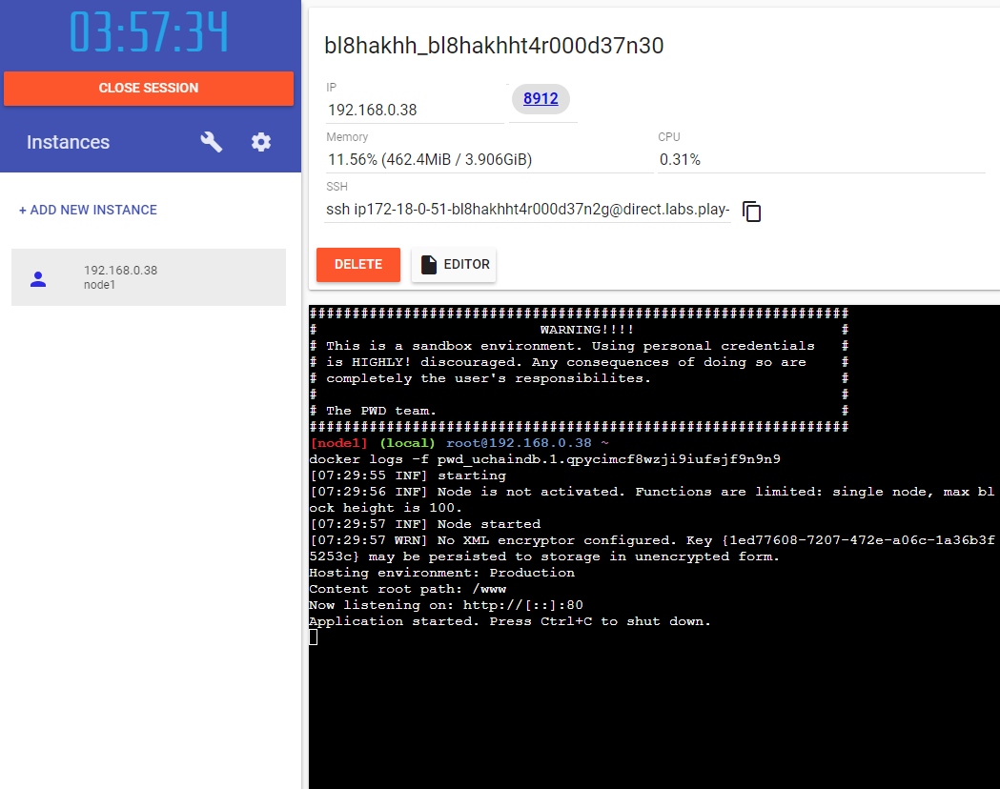

* Step 5: Click on the link named `8912` at the top of the page to open a tab to the running instance of uchaindb.

  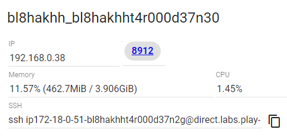
  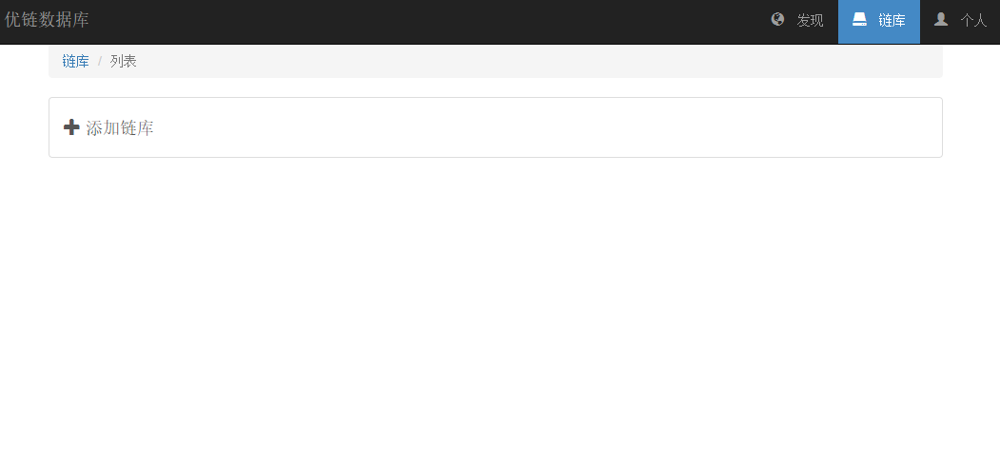

The demo will last up to 4 hours. It can also be stopped at any time by clicking on the `CLOSE SESSION` link at the top left of the "Play with Docker" page.

## First expression

After the initialization, you got yourself a demo environment.

* Step 1: Click `Connect ChainDb` button to connect to our demo environment.

  

* Step 2: In this page you have chance to open connection to existing chain db, or here we click `Connect to ChainDb manually`

  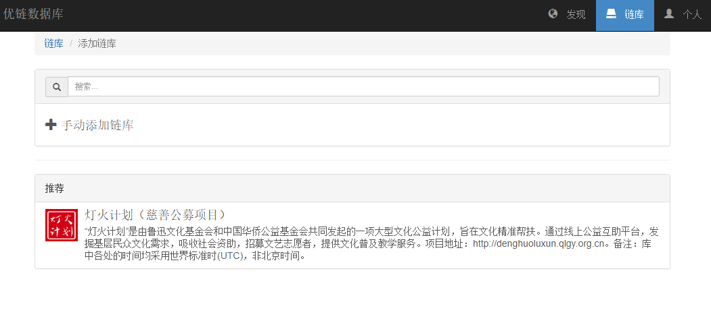

* Step 3: In address field, put in current page domain plus `/api/rpc`, here the example address is `http://ip172-18-0-51-bl8hakhht4r000d37n2g-8912.direct.labs.play-with-docker.com/api/rpc`

  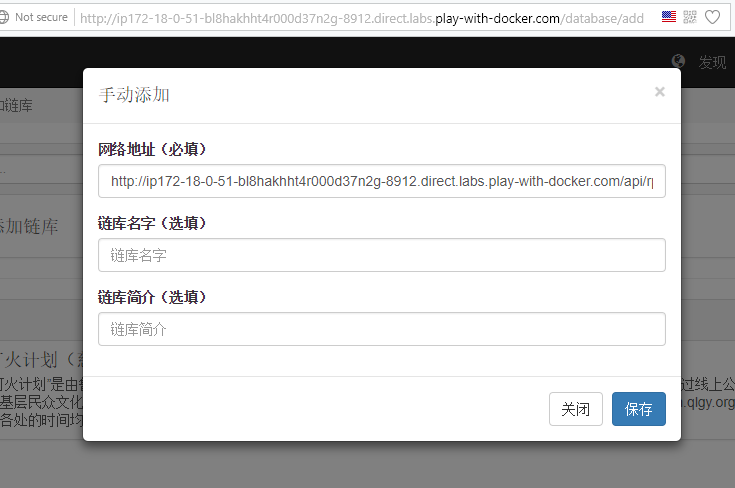

* Step 4: Finally, you got connected to your own demo ChainDb.

  

## Enable experiment feature

* Step 1: To enable experiment feature, click `Personal` first to enter personal center.

  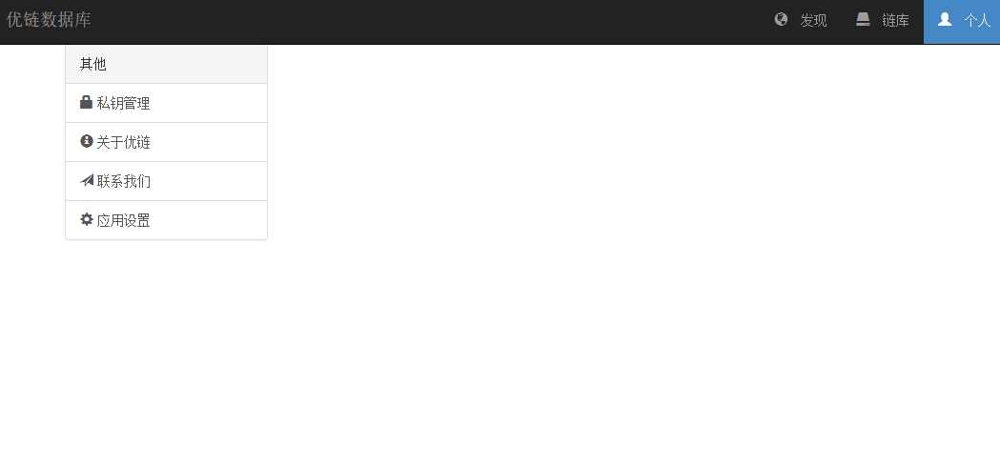

* Step 2: Click `Enable experiment feature` and confirm.

  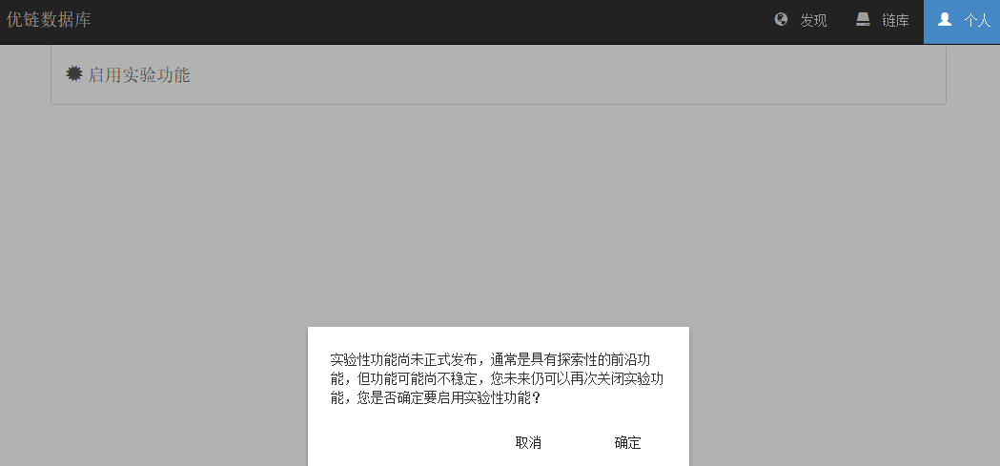

* Step 3: After confirmation, go back to `ChainDb` page.

  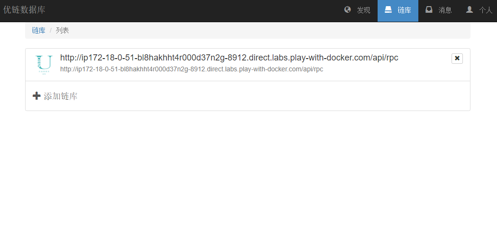

* Step 4: Click your connected ChainDb, you will find more feature available to use. 

  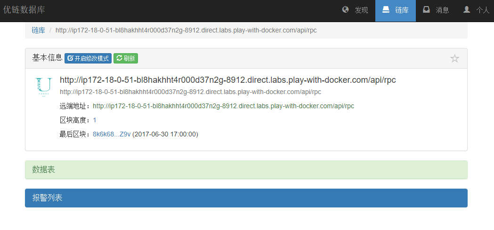